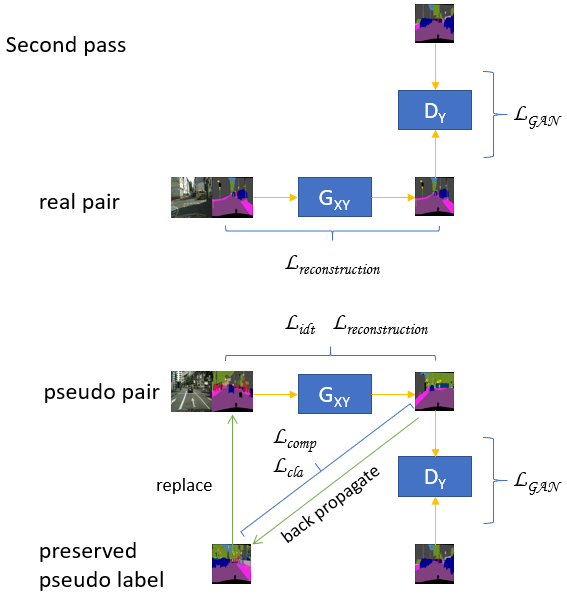

# Two-pass_I2I


## Data
Use this [repo](https://github.com/junyanz/pytorch-CycleGAN-and-pix2pix) to download the cityscape dataset.

## Architecture




## Usage

Example training command
```bash
python train.py --dataroot ./datasets/cityscapes --pseudo_data_root ./datasets/cityscape_pseudo  --name test --n_epochs 50 --lr 0.00005 --n_epochs_decay 50 --save_epoch_freq 20 --save_latest_freq 200 --update_html_freq 20 --display_id 0 --continue_train --display_freq 800 --epoch_count 1
```

Example testing command
```bash
python test.py --dataroot ./datasets/cityscapes --name test --model pix2pix --no_dropout
```